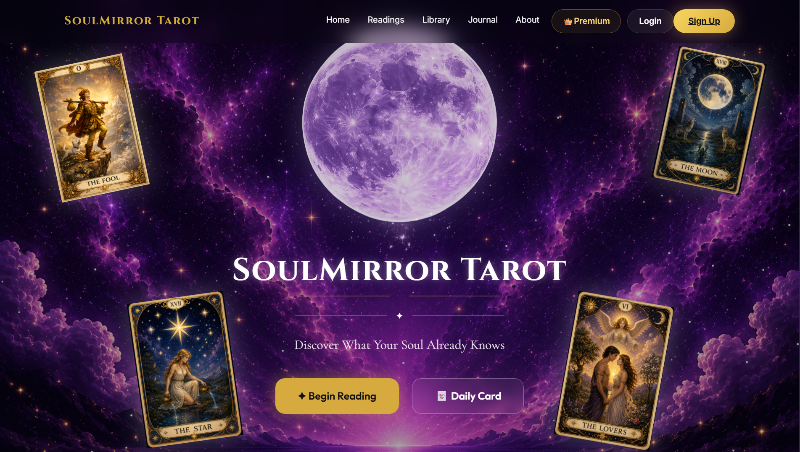
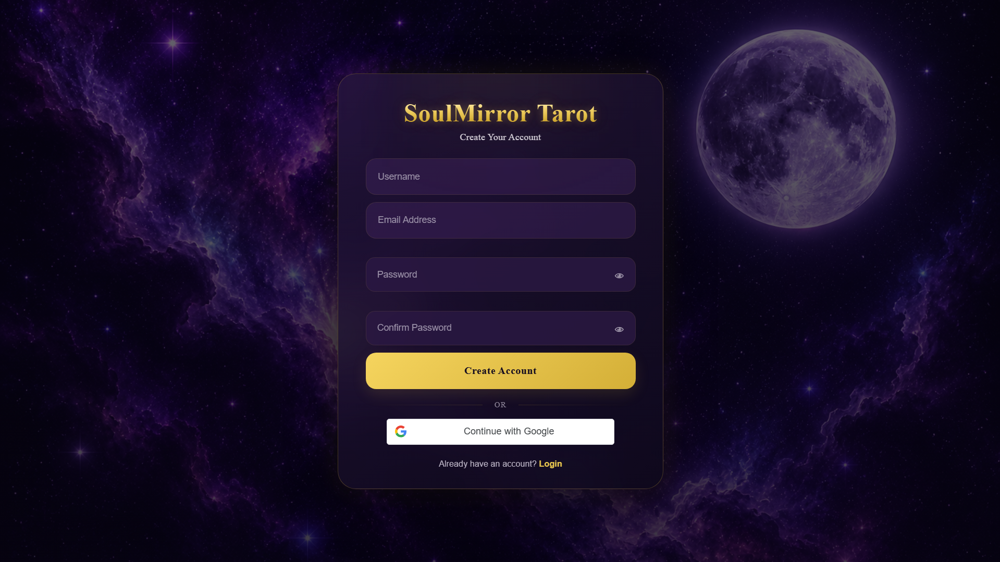
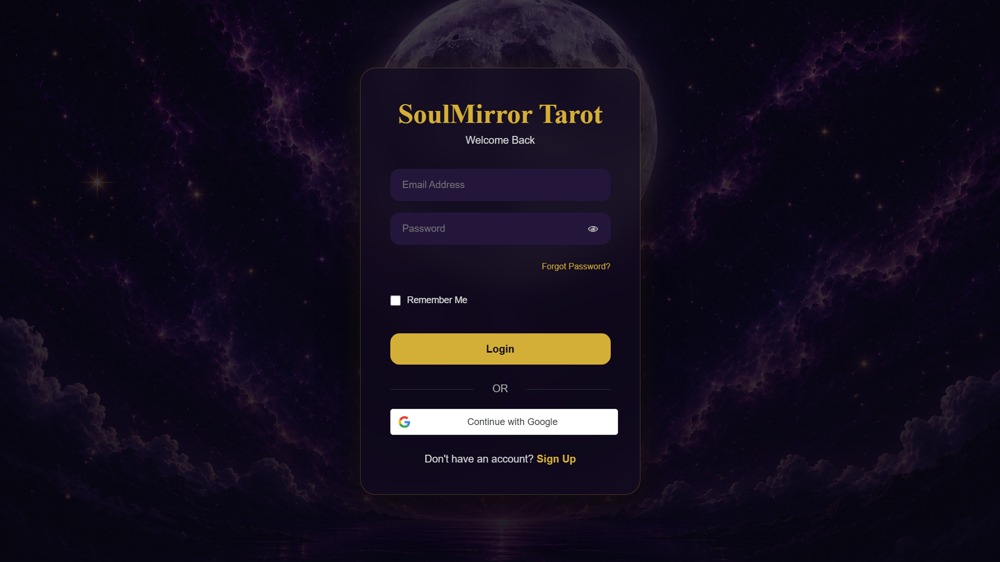
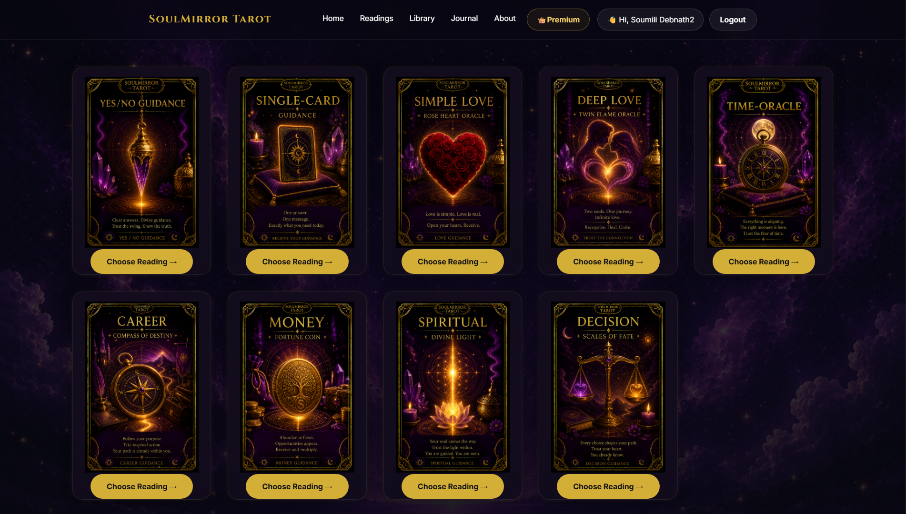
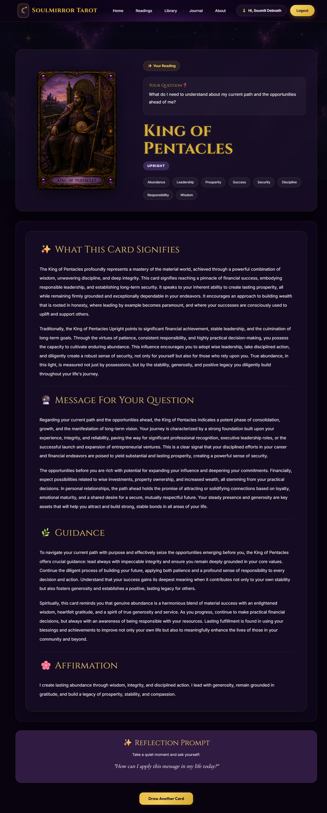
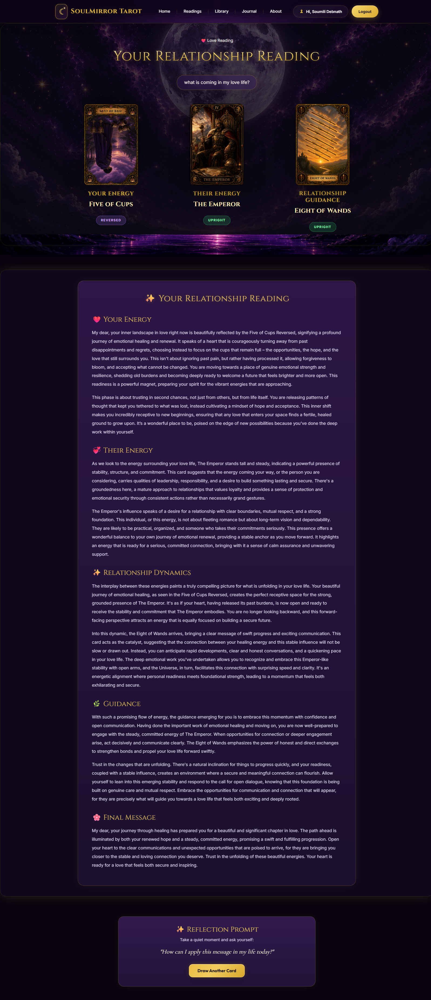
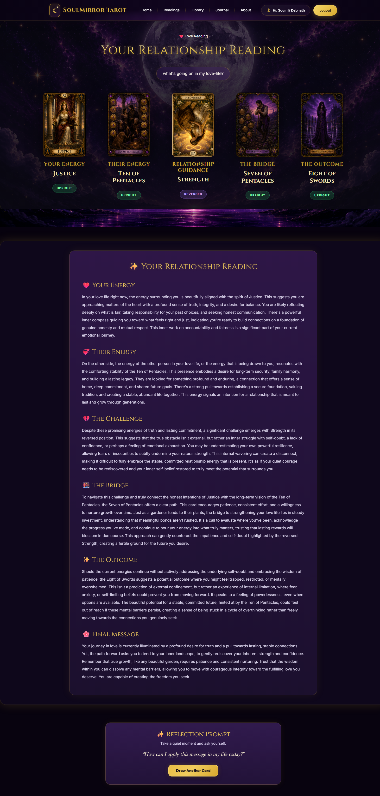
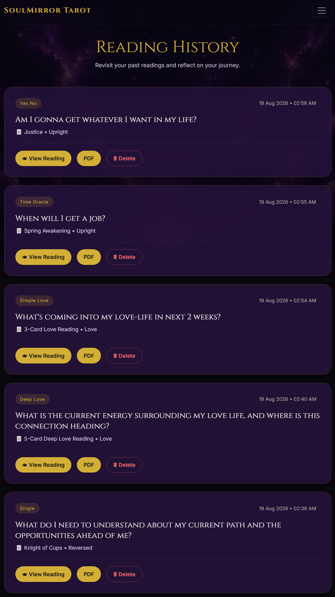
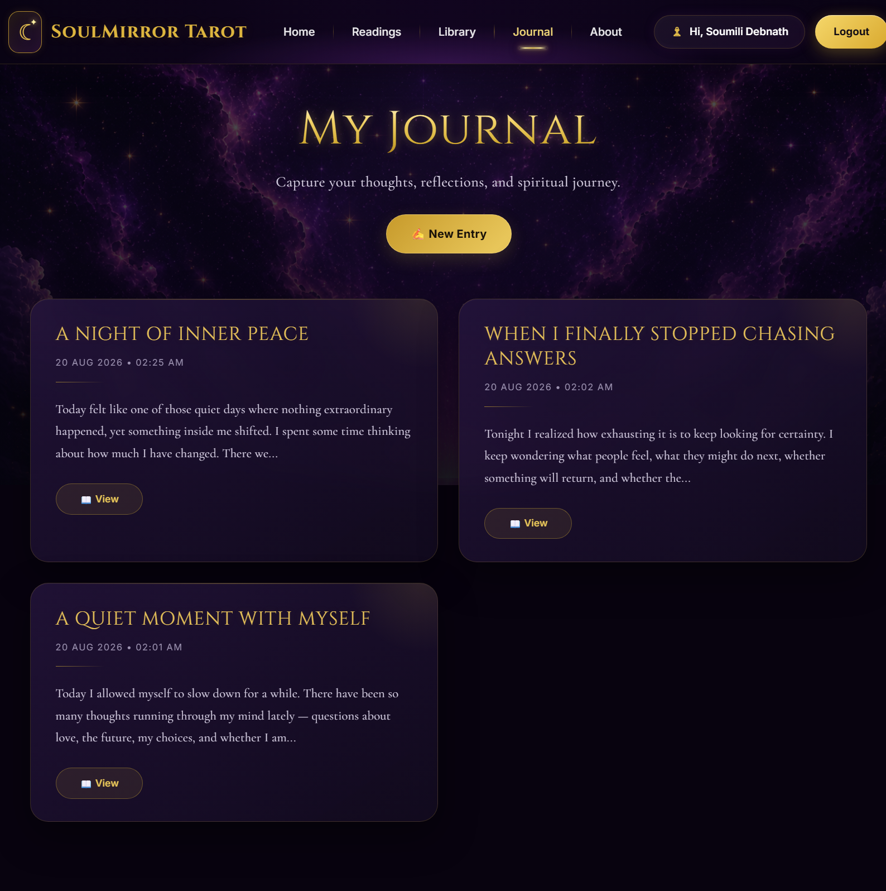
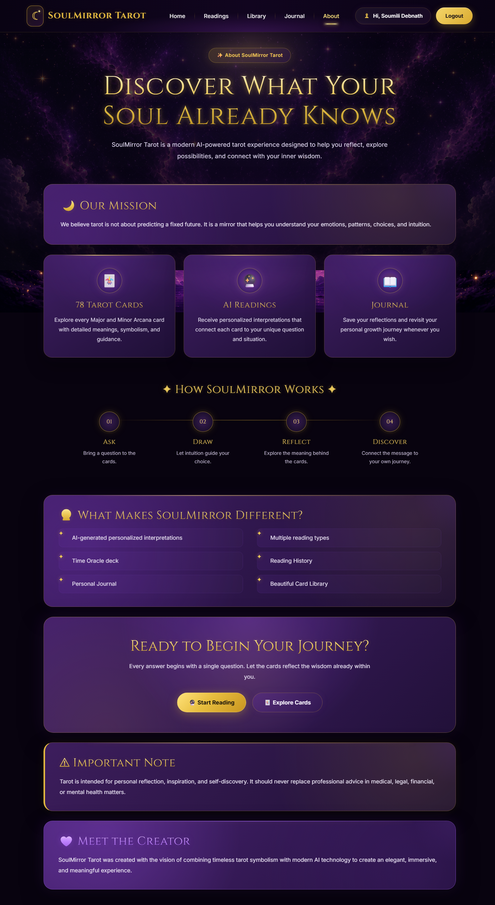

# 🌙 SoulMirror Tarot

### AI-Powered Tarot Reading & Self-Reflection Platform

SoulMirror Tarot is a full-stack web application that combines a digital tarot experience with AI-assisted interpretations, personalized readings, and an immersive mystical interface.

Built with **Python, Flask, HTML, CSS, JavaScript, and SQLite**, SoulMirror Tarot provides multiple tarot reading experiences while allowing users to securely manage their accounts, explore the complete tarot deck, maintain personal reflections, and revisit previous readings.

---

## ✨ Features

### 🔮 Multiple Reading Experiences

SoulMirror Tarot offers different reading formats designed for different questions, situations, and areas of life:

- 🃏 Single Card Reading
- ❤️ Simple Love Reading
- 💞 Deep Love Reading
- ❓ Yes / No Guidance
- ⏳ Time Oracle
- 💼 Career Reading
- 💰 Money Reading
- 🧭 Decision Reading
- 🧘 Spiritual Guidance
- 🌟 Daily Card

Each reading experience provides a dedicated interface and spread designed around its specific purpose.

---

### 🤖 AI-Assisted Tarot Interpretations

SoulMirror Tarot uses an AI-assisted interpretation system to provide contextual tarot readings based on the user's question and selected cards.

The application maintains a structured tarot knowledge base containing card-specific information such as:

- Upright meanings
- Reversed meanings
- Keywords
- Timing guidance
- Yes / No guidance
- Card correspondences
- Affirmations

The interpretation system combines the user's question with the selected tarot card information to generate a contextual reading.

---

### 🃏 Complete 78-Card Tarot Deck

SoulMirror Tarot includes a structured tarot knowledge base covering the complete traditional 78-card tarot deck.

#### Major Arcana

- 22 cards

#### Minor Arcana

- 14 Cups
- 14 Wands
- 14 Swords
- 14 Pentacles

**Total: 78 Tarot Cards**

Each card is represented using structured data containing information used throughout the reading system.

---

### 📚 Card Library

The Card Library provides an interactive visual collection of the complete tarot deck.

Users can:

- Browse the Major Arcana
- Browse Cups
- Browse Wands
- Browse Swords
- Browse Pentacles
- Search for cards
- Filter cards by category
- Explore the cards visually

The library is designed to provide a dedicated space for learning about and exploring the SoulMirror tarot deck.

---

### 🔐 Authentication

SoulMirror Tarot includes a complete user authentication system.

Users can:

- Create an account
- Log in using email and password
- Continue with Google
- Use Remember Me
- Log out securely
- Reset forgotten passwords
- Access personalized features through authenticated sessions

Passwords are securely hashed before being stored.

Google authentication is implemented using **Google Identity Services / OAuth 2.0**.

---

### 📖 Personalized Reading History

Authenticated users can revisit their previous readings through the Reading History section.

Stored reading information can include:

- Reading type
- User question
- Selected tarot cards
- Card orientation
- Generated interpretation
- Reading timestamp

Users can:

- View previous readings
- Download readings as PDF
- Select multiple readings
- Delete reading records

Reading timestamps displayed in the history interface are converted to **Indian Standard Time (IST)**.

---

### 📄 PDF Export

Users can export generated tarot readings as PDF documents.

PDF export allows users to keep their readings for:

- Offline reference
- Personal reflection
- Future review
- Personal records

---

### 📓 Personal Journal

SoulMirror Tarot includes a personal Journal space designed for reflection.

Users can record thoughts, experiences, and personal reflections alongside their tarot journey.

The Journal complements the reading experience by allowing users to maintain their own reflective notes.

---

### 🌙 Daily Card

The Daily Card experience provides a dedicated tarot message for the day.

Users can reveal their daily card and receive its corresponding interpretation.

The experience includes:

- Daily card reveal
- Card orientation
- Daily message
- Countdown until the next available card

---

### 🎨 Mystical Interactive UI

SoulMirror Tarot follows a dark celestial visual identity inspired by tarot, astrology, and the night sky.

The interface features:

- Cosmic backgrounds
- Purple and gold visual theme
- Tarot card artwork
- Star and particle effects
- Interactive card experiences
- Animated transitions
- Themed reading pages
- Responsive layouts
- Consistent navigation and authentication UI

The frontend is built using standard web technologies without React or other frontend frameworks.

---

## 🛠️ Tech Stack

### Backend

- Python
- Flask
- Flask-SQLAlchemy
- Flask-Login
- Flask-Bcrypt

### Frontend

- HTML5
- CSS3
- JavaScript
- Jinja2 Templates

### Database

- SQLite
- SQLAlchemy ORM
- Flask-Migrate
- Alembic

### Authentication

- Google OAuth 2.0
- Google Identity Services
- Flask-Login
- Flask-Bcrypt

### AI

- Python-based AI service architecture
- Structured tarot knowledge base
- Context-aware tarot interpretation

### PDF

- Python-based PDF generation service

---

## 📸 Screenshots

### 🏠 Landing Page — Before Login



The landing page introduces SoulMirror Tarot through its celestial interface and provides access to the primary tarot experience.

---

### 🔐 Authentication

#### Create Account



Users can create a personalized SoulMirror Tarot account using their username, email address, and password.

#### Login & Google Authentication



The login interface supports email/password authentication and Google authentication.

---

### 🔮 Reading Selection



Users can choose from multiple tarot reading experiences depending on the type of guidance they are looking for.

Available reading experiences include:

- Single Card Reading
- Simple Love Reading
- Deep Love Reading
- Yes / No Guidance
- Time Oracle
- Career Reading
- Money Reading
- Spiritual Guidance
- Decision Reading

---

### 🃏 Reading Result



The reading result interface presents the selected tarot card, its orientation, and the contextual interpretation generated for the user's question.

---

### ❤️ Simple Love Reading



A three-card love reading designed to explore relationship-related questions and emotional situations.

---

### 💜 Deep Love Reading



A five-card relationship spread exploring:

- ❤️ Your Energy
- 💞 Their Energy
- 💔 The Challenge
- 🌉 The Bridge
- ✨ The Outcome

---

### 📖 Reading History



Authenticated users can revisit their previous readings through their personalized Reading History.

The history interface allows users to:

- View previous readings
- Export readings as PDF
- Select multiple readings
- Manage saved reading records

---

### 🃏 Card Library

SoulMirror Tarot includes a visual library containing the complete traditional 78-card tarot deck.

#### Major Arcana

.png)

The Major Arcana section provides access to the 22 Major Arcana cards.

#### Cups

.png)

The Cups collection contains the 14 cards of the Cups suit.

#### Wands

.png)

The Wands collection contains the 14 cards of the Wands suit.

#### Swords

.png)

The Swords collection contains the 14 cards of the Swords suit.

#### Pentacles

.png)

The Pentacles collection contains the 14 cards of the Pentacles suit.

---

### 📓 Journal



The Journal provides a personal space where users can record thoughts, experiences, and reflections alongside their tarot journey.

---

### ℹ️ About SoulMirror Tarot



The About page introduces the concept behind SoulMirror Tarot and its approach to tarot-based self-reflection.

---

## 🏗️ Project Architecture

```text
SoulMirror-Tarot/
│
├── ai/
│   ├── engine.py
│   ├── generator.py
│   ├── knowledge.py
│   ├── memory.py
│   └── prompts.py
│
├── blueprints/
│   ├── auth/
│   │   └── routes.py
│   │
│   ├── dashboard/
│   │   └── routes.py
│   │
│   ├── main/
│   │   └── routes.py
│   │
│   └── reading/
│       └── routes.py
│
├── data/
│   ├── tarot/
│   └── time-oracle/
│
├── database/
│
├── migrations/
│
├── models/
│   ├── card.py
│   ├── journal.py
│   ├── love_reading.py
│   ├── reading.py
│   ├── spread.py
│   ├── subscription.py
│   └── user.py
│
├── reading/
│   ├── card_loader.py
│   └── daily_card.py
│
├── services/
│   ├── ai_service.py
│   └── pdf_service.py
│
├── static/
│   ├── css/
│   ├── images/
│   └── js/
│
├── templates/
│   ├── auth/
│   └── ...
│
├── utils/
│
├── docs/
│   └── screenshots/
│
├── app.py
├── config.py
├── extensions.py
├── requirements.txt
└── .gitignore

## 🔄 Application Flow

```text
User
│
├── Authentication
│   ├── Email / Password
│   └── Google OAuth
│
▼
SoulMirror Dashboard
│
▼
Choose Reading Type
│
├── Single Card
├── Simple Love
├── Deep Love
├── Yes / No
├── Time Oracle
├── Career
├── Money
├── Decision
└── Spiritual
│
▼
Enter Question
│
▼
Tarot Card Selection
│
▼
Card Orientation
│
├── Upright
└── Reversed
│
▼
AI-Assisted Interpretation
│
▼
Reading Result
│
├── Save Reading
├── Download PDF
└── View Later
│
▼
Reading History